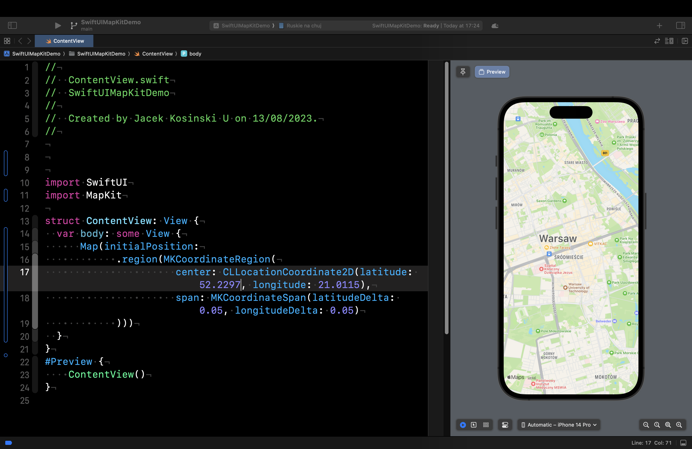
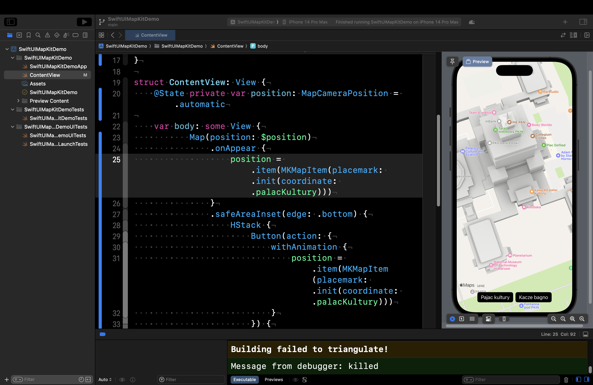
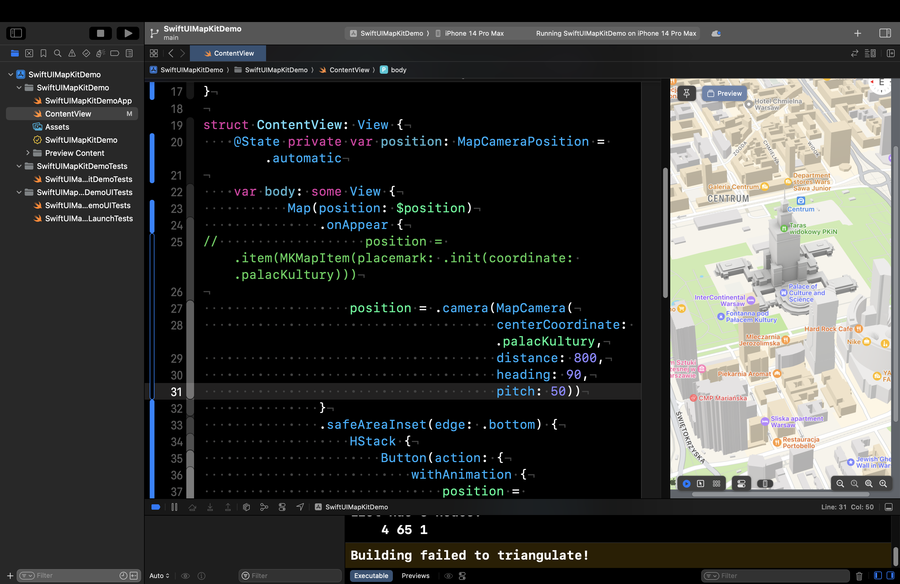

## Praca z MapKit i adnotacjami dla SwiftUI.


MapKit to potężny framework, który umożliwia programistom dodawanie map, adnotacji oraz funkcji opartych na lokalizacji do ich aplikacji na iOS. Dzięki SwiftUI można łatwo zintegrować MapKit w aplikacji i tworzyć interaktywne i dynamiczne mapy, które oferują świetne wrażenia użytkownika. W tym samouczku będziemy eksplorować, jak pracować z mapami i adnotacjami w SwiftUI, oraz jak dostosować styl mapy i położenie kamery.
Podstawy MapKit

Zaczniemy od podstaw MapKit. Framework MapKit zawiera widok Map, który programiści mogą wykorzystać do osadzania mapy w dowolnym projekcie SwiftUI. Oto przykład:

```swift
import SwiftUI
import MapKit
 
struct ContentView: View {
  var body: some View {
    Map()
  }
}
```

Przed użyciem widoku Map, musisz zaimportować framework MapKit. Następnie, aby stworzyć mapę, po prostu instancjonuj widok Map. Jeśli otworzyłeś podgląd na kanvasie w Xcode, powinieneś zobaczyć pełnoekranową mapę w symulatorze.


#### Zmiana początkowej pozycji kamery na mapie

Zamiast wyświetlania domyślnej lokalizacji, widok Map posiada inną metodę inicjalizacji, która pozwala zmienić początkową pozycję mapy:

```swift
init(
    initialPosition: MapCameraPosition,
    bounds: MapCameraBounds? = nil,
    interactionModes: MapInteractionModes = .all,
    scope: Namespace.ID? = nil
) where Content == MapContentView<Never, EmptyMapContent>
```

Możesz użyć instancji MapCameraPosition jako początkowej pozycji mapy. MapCameraPosition zawiera różne właściwości, których można użyć do kontrolowania, jakie miejsce lub region jest wyświetlane, w tym:

- `automatic`
- `item(MKMapItem)` – do wyświetlania określonego elementu mapy.
- `region(MKCoordinateRegion)` – do wyświetlania określonego regionu.
- `rect(MKMapRect)` – do wyświetlania określonych granic mapy.
- `camera(MapCamera)` – do wyświetlania istniejącej pozycji kamery.
- `userLocation()` – do wyświetlania lokalizacji użytkownika.

Na przykład, możesz zlecić mapie wyświetlenie konkretnego regionu, używając `.region(MKCoordinateRegion)`:

```swift
Map(initialPosition: 
      .region(MKCoordinateRegion(
                center: CLLocationCoordinate2D(latitude: 40.75773, longitude: -73.985708), 
                span: MKCoordinateSpan(latitudeDelta: 0.05, longitudeDelta: 0.05)
      )))
```

Wartości współrzędnych w powyższym przykładzie to koordynaty GPS Times Square w Nowym Jorku. Wartość span służy do określenia poziomu przybliżenia mapy. Im mniejsza wartość, tym większe jest przybliżenie.




Jeśli masz określoną lokalizację do wyświetlenia, możesz przekazać element mapy jako początkową pozycję. Oto przykład kodu:

```swift
extension CLLocationCoordinate2D {
    static let bigBen = CLLocationCoordinate2D(latitude: 51.500685, longitude: -0.124570)
}

struct ContentView: View {
    var body: some View {
        Map(initialPosition: .item(MKMapItem(placemark: .init(coordinate: .bigBen))))
    }
}
```

#### Animowanie zmiany pozycji na mapie

Widok Map dostarcza także dodatkową metodę inicjalizacji, która akceptuje binding do MapCameraPosition. Jeśli potrzebujesz zmienić pozycję mapy, ta metoda inicjalizacji jest bardziej odpowiednia:

```swift
@State private var position: MapCameraPosition = .automatic

Map(position: $position) {
   .
   .
   .
}
```

Na przykład, jeśli chcesz dodać dwa przyciski umożliwiające użytkownikom przełączanie się między dwiema lokalizacjami, kod może wyglądać tak:

```swift
extension CLLocationCoordinate2D {
    static let palacKultury = CLLocationCoordinate2D(latitude: 52.2297, longitude: 21.0115)
    static let kaczeBagno = CLLocationCoordinate2D(latitude: 52.220306, longitude: 21.017890)
}

struct ContentView: View {
    @State private var position: MapCameraPosition = .automatic

    var body: some View {
        Map(position: $position)
            .onAppear {
                position = .item(MKMapItem(placemark: .init(coordinate: .palacKultury)))
            }
            .safeAreaInset(edge: .bottom) {
                HStack {
                    Button(action: {
                        withAnimation {
                            position = .item(MKMapItem(placemark: .init(coordinate: .palacKultury)))
                        }
                    }) {
                        Text("Pajac kultury")
                    }
                    .tint(.black)
                    .buttonStyle(.borderedProminent)

                    Button(action: {
                        withAnimation {
                            position = .item(MKMapItem(placemark: .init(coordinate: .kaczeBagno)))
                        }
                    }) {
                        Text("Kacze bagno")
                    }
                    .tint(.black)
                    .buttonStyle(.borderedProminent)
                }
            }    
    }
}
```

Opakowując zmienną `position` w blok `withAnimation`, widok mapy automatycznie animuje zmianę pozycji.




Ta animacja działa jeszcze lepiej, gdy dostarczysz MapCamera z kątem przechylenia (pitch angle), aby stworzyć perspektywę 3D. Aby zobaczyć, co się dzieje, możesz spróbować zmienić pozycję Big Bena w następującej linii kodu:

```swift
position = .camera(MapCamera(
                   centerCoordinate: .palacKultury, 
                   distance: 800, 
                   heading: 90, 
                   pitch: 50))
```

Podglądając widok mapy, kąt kamery dostosowuje się, aby pokazać perspektywę 3D regionu.




Markery są użyteczną funkcją w MapKit, która pozwala wyświetlać treść w określonych współrzędnych na mapie. Dodają one dodatkową warstwę informacji do mapy, taką jak sklep czy restauracja. Markery można dostosowywać za pomocą systemowego obrazu i koloru odcienia, co sprawia, że są wizualnie odrębne i łatwe do rozpoznania. Niezależnie od tego, czy budujesz aplikację nawigacyjną czy przewodnik turystyczny, markery są wartościowym narzędziem, które pomaga tworzyć lepsze wrażenia użytkownika.

Aby dodać marker, możesz utworzyć widok Marker w bloku map content builder, na przykład:

```swift
Map(position: $position) {
    Marker("Odbiór tutaj", coordinate: .pickupLocation)
}
```

Opcjonalnie możesz dostosować obiekt Marker za pomocą systemowego obrazu. Aby zmienić kolor markera, użyj modyfikatora `tint`:

```swift
Marker("Odbiór tutaj", 
       systemImage: "car.front.waves.up", 
       coordinate: .pickupLocation)
       .tint(.purple)
```

Oprócz Marker, SwiftUI wprowadza w iOS 17 także widok Annotation do wskazywania lokalizacji na mapie. Funkcjonuje on podobnie jak Marker, ale oferuje większą elastyczność w dostosowywaniu.

Aby dodać adnotację, tworzysz widok Annotation w bloku map content. Oto przykładowy fragment kodu dla dodania prostej adnotacji:

```swift
Map(position: $position) {
    Annotation("Odbiór", coordinate: .pickupLocation, anchor: .bottom) {
        Image(systemName: "car.front.waves.up")
    }
}
```

Masz elastyczność w dostosowywaniu adnotacji na wiele sposobów. Poprzez dodawanie różnych modyfikatorów, możesz zmieniać jej wygląd i zachowanie. Dodatkowo, możesz używać widoków typu stack do układania różnych komponentów adnotacji i tworzenia układu, który pasuje do Twoich potrzeb. Oto przykład:

```swift
Annotation("Odbiór", coordinate: .pickupLocation, anchor: .bottom) {
    ZStack {
        Circle()
            .foregroundStyle(.indigo.opacity(0.5))
            .frame(width: 80, height: 80)
 
        Image(systemName: "car.front.waves.up")
            .symbolEffect(.variableColor)
            .padding()
            .foregroundStyle(.white)
            .background(Color.indigo)
            .clipShape(Circle())
    }
}
```

To prowadzi do animowanej adnotacji, jak pokazano na ilustracji poniżej.

#### Zmiana stylu mapy

Domyślnie widok mapy renderuje mapę w standardowym stylu. Jednakże, możesz zmienić styl, używając modyfikatora `mapStyle`:

```swift
Map {
 
}
.mapStyle(.imagery(elevation: .realistic))
```

To tworzy styl mapy oparty na obrazach satelitarnych. Poprzez określenie `realisticelevation`, widok mapy renderuje trójwymiarową mapę o realistycznym wyglądzie.

Opcjonalnie, możesz również zmienić styl mapy na hybrydowy, tak jak to:

```swift
.mapStyle(.hybrid)
```

#### Podsumowanie

Ten samouczek omawia, jak pracować z mapami i adnotacjami w SwiftUI, używając frameworku MapKit. Najnowsza wersja SwiftUI oferuje dodatkowe interfejsy API i widoki, które pozwalają programistom dalsze dostosowanie widoku mapy. Na tym etapie powinieneś wiedzieć, jak osadzać mapę w swojej aplikacji i dodawać adnotacje, aby wyróżnić lokalizację na mapie.